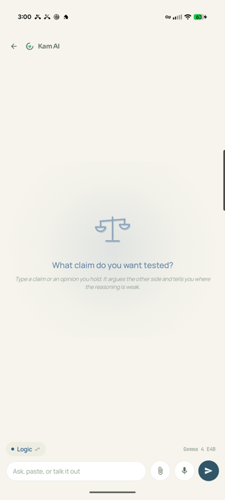
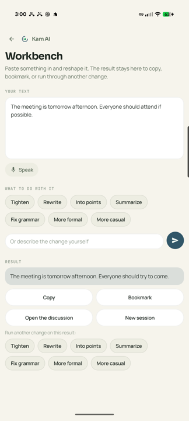
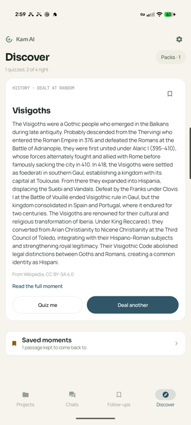
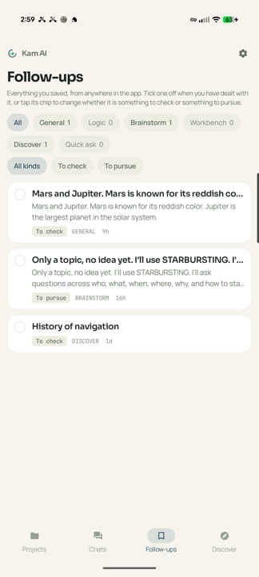
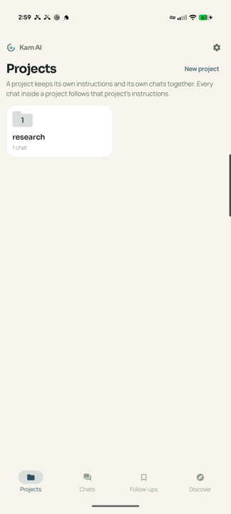

# Kam AI

**A private thinking and drafting tool that runs entirely on your phone.**

Kam AI downloads an AI model onto your Android phone and runs it there. Your
conversations, memory, projects and follow-ups stay on the device. There is no
account, no subscription, no ads, and nothing is collected. Turn on airplane
mode and it still works.

> Kam AI is under active construction. This README describes what is built so
> far and is updated at the end of every phase.

## What it is, and what it is not

Kam AI is good at transforming, organizing and rephrasing text you give it, at
everyday questions, and at pushing back on your ideas.

**Kam AI is not a private ChatGPT.** A model small enough to fit on a phone
knows less than the big cloud models, gets some facts wrong, cannot make images,
and is weaker at long polished documents. The app says so plainly and builds
around it: anything worth checking gets a bookmark into Follow-ups instead of a
confident guess.

There are no characters, no roleplay, no pretend companion, and no emotional
manipulation. Those are stated design commitments, not just internal rules.

**It thinks with you, not for you.** That is the difference the modes are built
around, and it is why one of them refuses to hand you ideas at all.

## The four modes

One AI, four ways of working. A mode is chosen when a chat starts and can be
switched at any time.

| Mode | What it does |
|---|---|
| **General** | Everyday questions and back-and-forth. |
| **Logic Partner** | Argues the other side and pokes holes in your thinking. It concedes when you are right, and does not fold just because you disagree. |
| **Brainstorm** | Will not hand you ideas. It pulls them out of you, using a named facilitation method and asking one question at a time. |
| **Workbench** | Paste something in and get it rewritten, tightened, or reorganized. Sessions are saved and can be reopened, and each can be linked to a chat about its result. |

Discover is not a mode. It is a source: offline packs of short reads you can pull
one from and then discuss, with its own tab.

## Screenshots

| | | |
|---|---|---|
|  |  |  |
| A new chat, in the mode's own colour and voice | Switching mode mid-conversation, without losing what was said | Workbench: paste text in, pick a change, keep both versions |
|  |  |  |
| Discover deals you something to read, offline | Follow-ups collects everything you saved, from anywhere | Projects keep related chats under shared instructions |

## More than a chat box

- **Hold the power button** to ask something without leaving what you are doing.
  Speak or type; the answer arrives over the top of whatever is on screen.
- **Talk instead of typing.** Your voice becomes text on the phone itself, with
  whisper.cpp, and the model will tidy a rambling voice note into notes or a
  draft.
- **Attach a document** and ask about what is in it. The file never leaves the
  phone, and if it is longer than the model can hold, the app says so rather
  than quietly truncating it.
- **Projects** keep related chats together under instructions they all follow.
- **Follow-ups** is one bookmark for the whole app: anything worth checking or
  coming back to lands in the same list, told apart by where it came from.
- **Memory** keeps the durable things it notices. Everything it has kept is
  listed in full in Settings, and any of it can be deleted.
- **Read aloud** with an on-device voice, male or female, downloaded separately.
- **Backup and restore** writes everything to one passphrase-locked file, so
  moving to a new phone does not mean starting over.

## Install

Two ways to get it, and they are the same app.

**Google Play.** The usual route. Updates arrive on their own.

**GitHub releases.** For people who avoid the Play Store or run a de-Googled
device, every version is also published here as a plain APK you can download and
install directly. Grab the newest `.apk` from
[Releases](https://github.com/kamsiob/kam-ai/releases). The first time you open
an APK, Android will ask you to allow installs from whichever app you used to
open it, usually your browser or file manager. That is a one time permission for
that app, not for Kam AI.

The two builds are signed with different keys, so Android treats them as
separate apps. You cannot install one on top of the other. To switch, uninstall
the one you have first, then install the other. Your conversations can come with
you: use Settings, then Backup and restore to export a file before uninstalling,
and import it after.

## Building it yourself

You need the Android SDK with platform 37 and NDK 28, plus a JDK 21. Then:

    git clone https://github.com/kamsiob/kam-ai.git
    cd kam-ai
    ./tools/fetch_llama.sh          # pulls llama.cpp at the pinned tag
    ./tools/fetch_whisper.sh        # pulls whisper.cpp for voice typing
    ./tools/fetch_sherpa.sh         # pulls the sherpa-onnx voice runtime and data
    ./gradlew :app:assembleDebug

The three fetch scripts pull the native dependencies (llama.cpp, whisper.cpp, and
the sherpa-onnx text-to-speech runtime) at pinned versions, kept out of git to
keep the tree small. They are the only setup step beyond the SDK.

llama.cpp is fetched rather than committed, so a clone stays small. The tag it
pins lives in `tools/fetch_llama.sh`.

To run the native smoke test on a connected phone, which loads a tiny model and
generates tokens through the JNI bridge:

    ./tools/fetch_smoke_model.sh
    ./gradlew :app:connectedDebugAndroidTest

## How it is put together

- Kotlin and Jetpack Compose, single activity, Material 3 with a fully custom
  theme. No dynamic colour, because the palette carries meaning.
- llama.cpp compiled for arm64 behind a thin JNI bridge. The generation loop
  lives in Kotlin so streaming, stopping and thermal backoff sit next to the
  rest of the app's logic.
- One SQLite database through Room holds everything, shaped so a backup can be
  written as a single portable file.
- `DESIGN.md` is the binding source of truth for how the app looks, moves and
  speaks. Where code and that document disagree, the document wins.
- `DECISIONS.md` records every nontrivial call made while building, including
  the ones that turned out to be wrong.

## Licence

App code is AGPL-3.0. See [LICENSE](LICENSE).

Content packs for Discover are built from Wikipedia and carry CC BY-SA 4.0,
which applies to the pack content only.

## Links

- Privacy policy: [PRIVACY.md](PRIVACY.md)
- YouTube: [@kamsiob](https://youtube.com/@kamsiob)
- Website: [kamsiob.com](https://kamsiob.com)
- Feedback: hello@kamsiob.com

Built and carried by one person. If software made this way matters to you,
there's a place to
[stand behind it](https://buymeacoffee.com/kamsiob). Either way, it's yours.
