# Kam AI

**An AI that runs on your phone instead of somebody else's computer.**

You download a model once. After that, everything happens on the device: what you
ask, what it answers, and anything you save. There is no account to create,
nothing to subscribe to, no ads, and nothing about you is sent anywhere. Put the
phone in airplane mode and it still works.

> Kam AI is still being built. This page describes what actually works today, not
> what is planned.

## What it is good at, and what it is not

It is at its best when you give it something to work with: tidying a messy draft,
reorganizing notes you dumped in a hurry, answering everyday questions, and
arguing with an idea until you know whether it holds up.

**It is not a private ChatGPT, and saying it was would be dishonest.** A model
small enough to live on a phone knows less than the enormous ones running in data
centers. It gets facts wrong sometimes, it cannot make pictures, and it is weaker
at long, polished documents. The app is built around admitting that rather than
hiding it. When something is worth double checking, you get a bookmark to come
back to instead of a confident guess.

**The modes ask different amounts of the model, and that is worth knowing before
you choose one.** General and Workbench are the forgiving ones: answering a
question, and reshaping text you have already provided, are things a small model
does well. Logic Partner and Brainstorm ask more, because holding an argument or
running a session means keeping track of what you said several turns ago and
sticking to an approach. A smaller model does those less reliably. This is a
tradeoff rather than a defect, and the app says which model it recommends for your
phone, what each one is stronger and weaker at, and tells you once if you open a
mode the installed model is poor at.

There are no characters to talk to, no roleplay, no pretend friend, and nothing
engineered to keep you opening the app. Those are commitments, not settings you
can turn on later.

**It thinks with you, not for you.** That is what the four modes are really
about, and it is why one of them refuses to hand you ideas at all.

## The four modes

Same AI, four ways of working. You pick one when a chat starts, and you can
switch at any point without losing what was said.

| Mode | What it does |
|---|---|
| **General** | Ordinary questions and back and forth. Start here. |
| **Logic Partner** | Takes the opposite side and tests your reasoning. It admits when you are right, and it does not cave just because you pushed back. |
| **Brainstorm** | Refuses to hand you ideas. It asks one question at a time and pulls your own out of you instead. |
| **Workbench** | Paste something in and get it rewritten, tightened or reorganized. Sessions are saved, and each one can be linked to a chat about the result. |

Discover is not a mode, it is somewhere to read. Offline packs of short articles:
pull one out, read it, then talk about it.

## What it looks like

Real captures from the phone, never mockups.

<table>
<tr>
<td width="33%">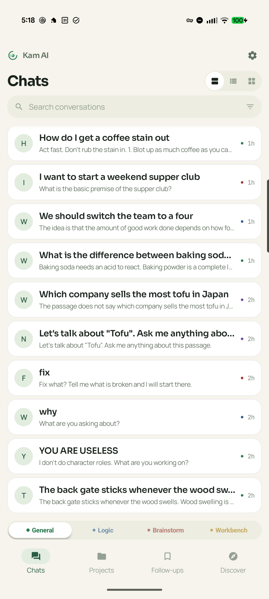</td>
<td width="33%">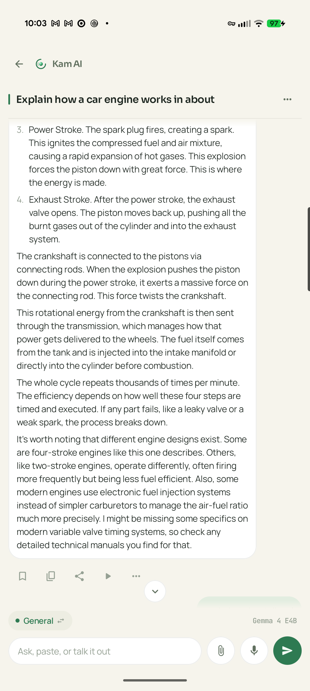</td>
<td width="33%">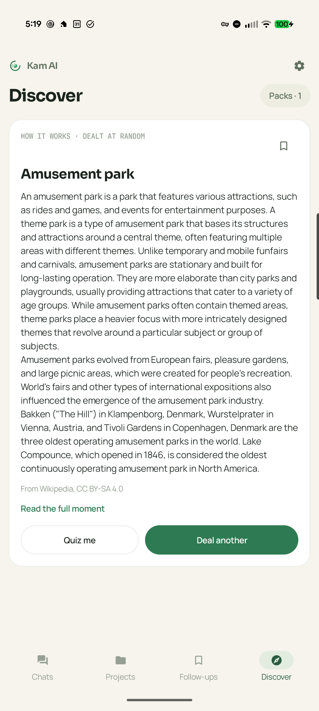</td>
</tr>
<tr>
<td><b>Your chats.</b> The four modes sit along the bottom. Tapping one starts a new conversation with that job.</td>
<td><b>A conversation.</b> Answers use headings and lists when the content needs them, and plain sentences when it does not.</td>
<td><b>Discover</b> deals you something to read, offline, then discusses it without wandering off the page.</td>
</tr>
<tr>
<td>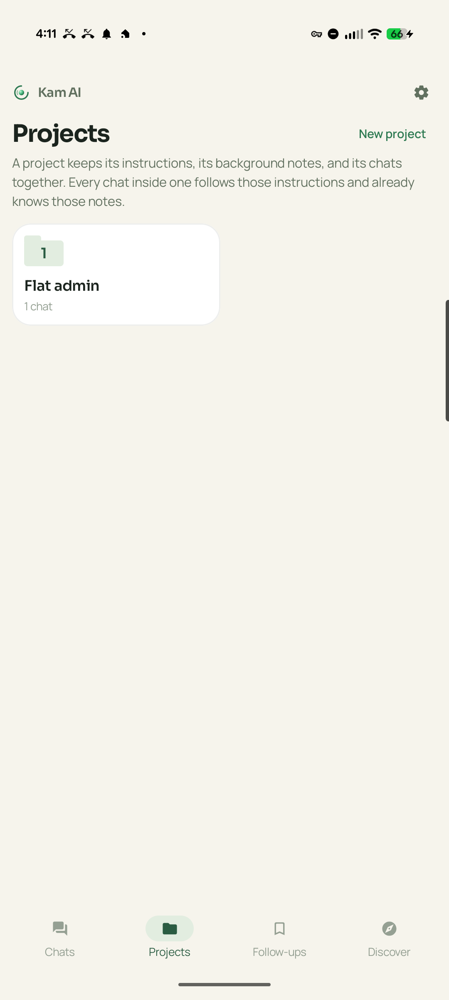</td>
<td>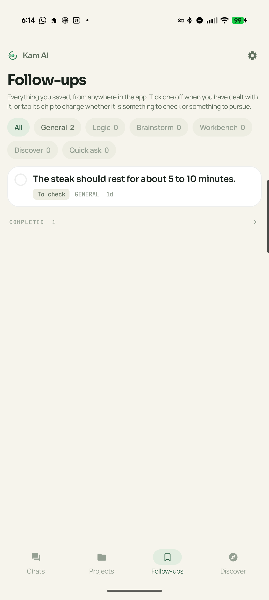</td>
<td>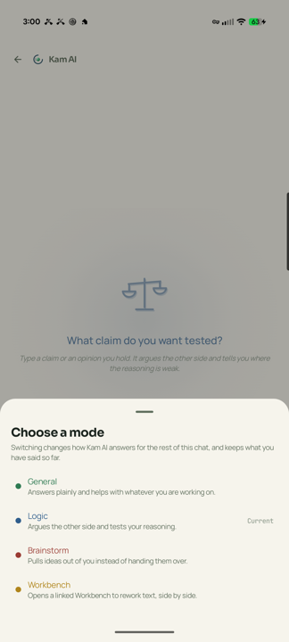</td>
</tr>
<tr>
<td><b>Projects</b> keep related chats together under instructions and notes they all share.</td>
<td><b>Follow-ups</b> is where everything you saved ends up, from anywhere in the app.</td>
<td><b>Switching mode</b> partway through a chat, keeping everything already said.</td>
</tr>
</table>

<b>The same screens in dark</b>

 

<table>
<tr>
<td width="33%">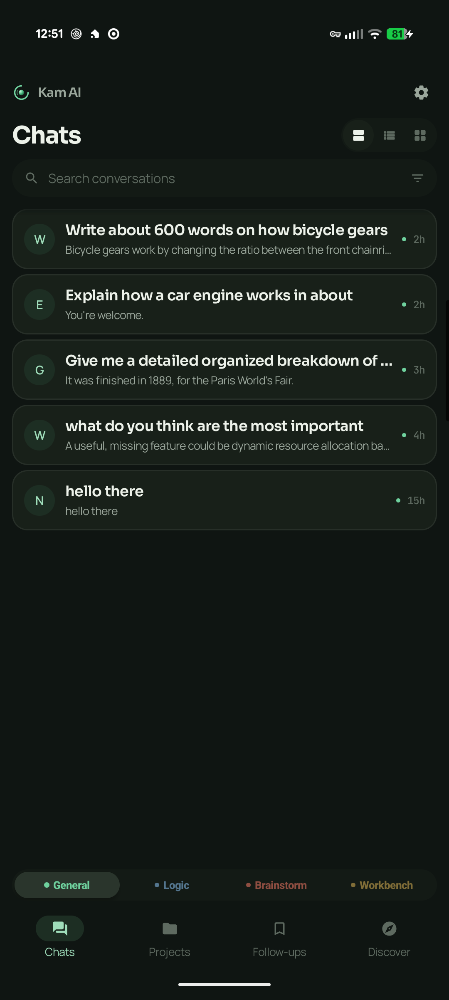</td>
<td width="33%">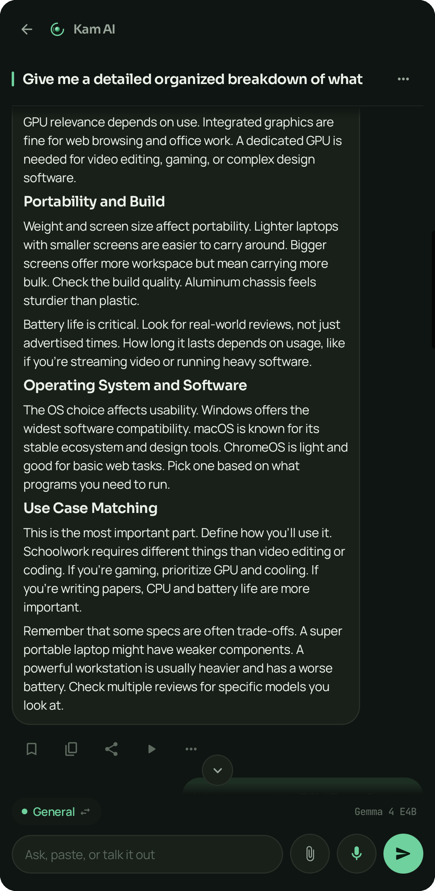</td>
<td width="33%">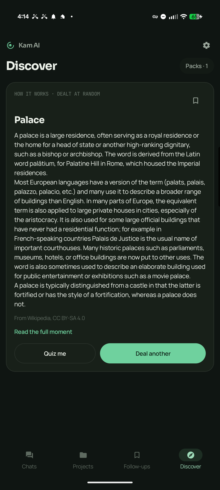</td>
</tr>
<tr>
<td>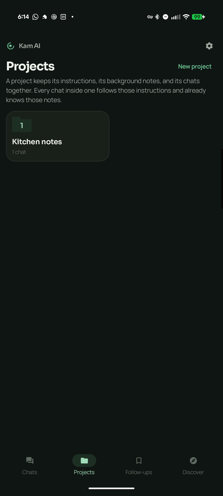</td>
<td>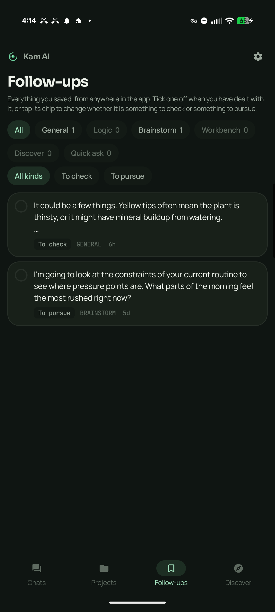</td>
<td>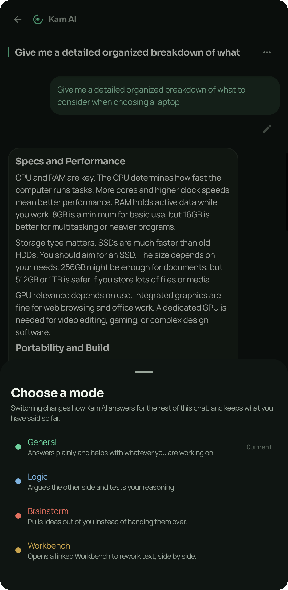</td>
</tr>
</table>

## What else it does

- **Hold the power button** to ask something without leaving whatever you are in
  the middle of. Speak or type, and the answer appears over the top of the app
  you were using.
- **Talk instead of typing.** Your voice is turned into text on the phone itself,
  and it will tidy a rambling voice note into something you can actually use.
- **Attach a document** and ask about what is in it. The file never leaves the
  phone. If it is too long to fit, the app tells you rather than quietly cutting
  off the end and answering anyway.
- **Projects** keep related chats together, with instructions and background that
  every chat inside them already knows.
- **Follow-ups** is one bookmark for the whole app. Anything worth checking, or
  worth coming back to, lands in the same list.
- **Memory** holds the lasting things it picks up about you. You can read all of
  it in Settings, and delete any of it.
- **Read aloud** in a voice that also runs on the phone. Male or female,
  downloaded separately so you only get it if you want it.
- **Backup and restore** puts everything into one file locked with a passphrase
  you choose, so moving to a new phone does not mean starting over.

## Install

Two ways to get it. Same app either way.

**From Google Play.** The normal route, and updates arrive on their own.

**Straight from here.** If you avoid the Play Store, or your phone has no Google
services on it, every version is also published as a plain APK you can install
yourself. Download the newest `.apk` from
[Releases](https://github.com/kamsiob/kam-ai/releases) and open it. Android will
ask once whether to allow installs from whichever app you opened it with, usually
your browser or file manager. That permission is about that app, not about Kam AI.

One thing worth knowing before you choose: the two are signed with different keys,
so Android treats them as separate apps and will not install one over the other.
If you want to switch later, uninstall the one you have first. Your conversations
can come with you. Go to Settings, then Backup and restore, and export a file
before you uninstall, then import it afterwards.

## Building it yourself

You need the Android SDK with platform 37 and NDK 28, plus a JDK 21. Then:

    git clone https://github.com/kamsiob/kam-ai.git
    cd kam-ai
    ./tools/fetch_llama.sh          # pulls llama.cpp at the pinned tag
    ./tools/fetch_whisper.sh        # pulls whisper.cpp for voice typing
    ./tools/fetch_sherpa.sh         # pulls the sherpa-onnx voice runtime and data
    ./gradlew :app:assembleDebug

The three fetch scripts pull the native dependencies (llama.cpp, whisper.cpp, and
the sherpa-onnx text-to-speech runtime) at pinned versions, kept out of git to
keep the tree small. They are the only setup step beyond the SDK.

llama.cpp is fetched rather than committed, so a clone stays small. The tag it
pins lives in `tools/fetch_llama.sh`.

To run the native smoke test on a connected phone, which loads a tiny model and
generates tokens through the JNI bridge:

    ./tools/fetch_smoke_model.sh
    ./gradlew :app:connectedDebugAndroidTest

## How it actually works

The technical section. Everything above is written for someone deciding whether
to install it; this part assumes you want to know what is under it.

**Inference.** llama.cpp, pinned to a known tag and compiled from source for
arm64, behind a deliberately thin JNI bridge. The generation loop lives in Kotlin
rather than in C++, so streaming, cancellation and thermal backoff sit next to the
rest of the app's logic instead of being trapped behind the native boundary. Built
with `-O3` and the ARM extensions that matter on recent silicon: dotprod, i8mm,
fp16, weight repacking, flash attention on auto, `mmap` for the weights. Thread
count is capped to the performance cores, which alone was worth 54 percent on the
mid tier model. GPU offload is not used; on this stack it is slower than CPU, and
that measurement is written down rather than assumed.

**The KV cache is treated as a real asset.** Reopening a conversation restores its
cache from disk through `llama_state_seq_get_data` instead of re-reading the
transcript, which took one measured case from 656 tokens and 20 seconds down to 29
tokens and 2 seconds. Prefix diffing means an ongoing conversation only ever
prefills what actually changed.

**Which model you get depends on your phone.** Memory is measured at runtime and a
tier is chosen from it, because loading a model that does not fit does not degrade
gracefully, it fails. There is one model resident at a time, on purpose.

**Storage.** One SQLite database through Room, encrypted with SQLCipher. The key
is a software data key wrapped by the Android Keystore, and the reason it works
that way is worth stating: hardware backed StrongBox turned out to encrypt about
13 bytes in 20 seconds, which is fine for wrapping a key and useless for
encrypting a database. The schema is deliberately flat and free of device specific
values, so a backup is one portable file rather than an export that only restores
onto the phone it came from.

**It is already sync ready, though nothing syncs.** Every row carries a Lamport
stamp and the identity of the install that wrote it, deletions leave tombstones,
and the conflict rule is tested for convergence from both sides. There is no sync
transport, no server, and no networking written for sync. Those pieces are free to add before
there is data in the wild and impossible to add correctly afterwards.

**Interface.** Kotlin and Jetpack Compose, one activity, Material 3 with a fully
custom theme and no dynamic color, because the palette carries meaning that a
wallpaper should not be allowed to reassign.

**Voice.** whisper.cpp for speech to text and sherpa-onnx for speech back, both on
the device, both in their own shared libraries with their own copy of ggml so the
two never collide at link time.

[ARCHITECTURE.md](ARCHITECTURE.md) goes further: the components and their
responsibilities, the threading and lifecycle model, and where the constraints
come from. [DECISIONS.md](DECISIONS.md) has the reasoning behind each of the calls
above, including the ones that turned out to be wrong.

## Approach

The app is written down before it is built. [MASTER_SPEC.md](MASTER_SPEC.md) says
what it does and [DESIGN.md](DESIGN.md) says how it looks, moves and speaks, down
to the wording. Both are kept current with the code rather than written once at
the start, and where the code and those documents disagree, the documents are
right and the code is wrong.

Decisions are recorded as they are made. [DECISIONS.md](DECISIONS.md) holds every
architectural and product call that was not obvious, along with why, including the
ones that turned out to be wrong and the approaches that failed and should not be
tried again. Two feature requests are in there as declined, with the arithmetic
that rules them out, so nobody has to relitigate them from scratch.

Work is tracked in the open. The
[project board](https://github.com/users/Kamsiob/projects/1) is public and holds
every issue, open and closed, what platform it belongs to, and what state it is
in. An issue says what the situation is, why it matters, and what would have to be
true for it to be finished, so closing one is checkable rather than a matter of
opinion.

Nothing counts as finished until it has run on a real phone. Tests are necessary
and nowhere near sufficient: several defects in this codebase compiled cleanly,
passed their tests, and were still wrong on the device. Some of the most useful
comments in the source are the ones recording exactly that.

[HANDOFF.md](HANDOFF.md) exists so the project can be picked up cold, with the
measurements taken, the things that failed, and an honest account of everything
unfinished.

### How this is built

Claude Code writes the implementation. I do the design, the specifications, the
decisions, and the verification.

That split holds all the way down. I decide what gets built and what gets cut,
write the specification each piece is built against, record the architectural and
product decisions along with the reasoning, and confirm everything on real
hardware before it counts as finished.

The harder part turned out to be directing it. Long unsupervised runs fail in
specific ways. They stop early believing the work is complete, run out of working
context mid task, report success for code that was written but never run, and
occasionally take an action nobody asked for. Most of the process described above
exists because of one of those. The resume document, the rule that nothing is
finished until it runs on the device, the decision records, the limits on what the
agent may touch: each answers something that actually went wrong.

What it has given me is precision about what I am asking for, and an unwillingness
to accept finished without seeing it work.

## License

App code is AGPL-3.0. See [LICENSE](LICENSE).

Content packs for Discover are built from Wikipedia and carry CC BY-SA 4.0,
which applies to the pack content only.

## Project

- [Board](https://github.com/users/Kamsiob/projects/1): what is being worked on, what is blocked, and what has shipped
- [Roadmap](ROADMAP.md): what is planned and what is deliberately not
- [Issues](https://github.com/Kamsiob/kam-ai/issues): the authoritative record of state
- [Contributing](CONTRIBUTING.md), [Architecture](ARCHITECTURE.md), [Security](SECURITY.md), [Code of conduct](CODE_OF_CONDUCT.md)

## Links

- Privacy policy: [PRIVACY.md](PRIVACY.md)
- YouTube: [@kamsiob](https://youtube.com/@kamsiob)
- Website: [kamsiob.com](https://kamsiob.com)
- Feedback: hello@kamsiob.com

Built and carried by one person. If software made this way matters to you,
there's a place to
[stand behind it](https://buymeacoffee.com/kamsiob). Either way, it's yours.
